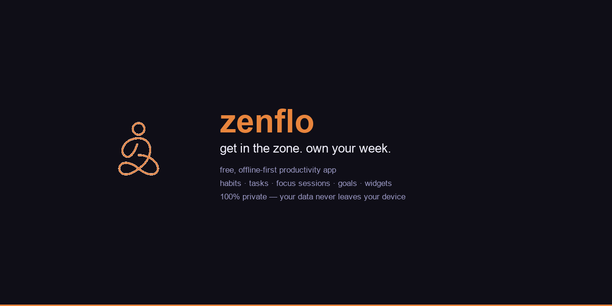

<p align="center">
  
</p>

# zenflo

A free, offline-first productivity app that helps you build habits, crush tasks, and track your growth — without selling your data.

No subscriptions. No ads. No accounts. Your data never leaves your device.

## Features

- **Unified Dashboard** — Habits, goals, tasks, focus sessions, streaks, and timeline in one scroll
- **Habit Tracking** — Daily habits with streak tracking, freeze tokens, and completion rates
- **Goal Cockpit** — Goals with importance levels, target dates, and visual progress bars
- **Focus Sessions** — 20/30/60 min presets + custom duration, with XP rewards
- **Categories** — Organize everything by Work, Health, Personal, Hobby, or custom categories
- **XP & Leveling** — Earn XP from everything you do. Level up across 8 tiers from Initiate to Zenmaster
- **12 Badges** — Unlock achievements as you grow
- **Weekly Flight Log** — Sunday reflection with habit score, tasks completed, and personal notes
- **Analytics Dashboard** — Weekly XP charts, XP by source, time by category, 30-day habit performance
- **iOS Widgets** — Small and medium home screen widgets with deep linking
- **Light & Dark Themes** — Warm orange light mode and zen dark mode
- **Calendar Sync** — Apple Calendar, Google Calendar, or both
- **Smart Notifications** — Morning ritual, streak-at-risk, and flight log reminders with custom times
- **Achievements Screen** — Badges and streak freeze tokens in a dedicated view
- **100% Offline** — Zero data collection, no servers, no analytics

## Tech Stack

- [Expo](https://expo.dev) (SDK 54)
- [React Native](https://reactnative.dev) 0.81
- [Expo Router](https://docs.expo.dev/router/introduction/) — File-based navigation
- [expo-sqlite](https://docs.expo.dev/versions/latest/sdk/sqlite/) — Local SQLite database
- [Zustand](https://github.com/pmndrs/zustand) — State management
- [expo-calendar](https://docs.expo.dev/versions/latest/sdk/calendar/) — Native calendar integration
- [expo-notifications](https://docs.expo.dev/versions/latest/sdk/notifications/) — Local notifications
- [date-fns](https://date-fns.org) — Date utilities

## Project Structure

```
app/                        # Expo Router screens
  (home)/
    _layout.tsx             # Bottom tab navigation (Dashboard, Analytics, Profile)
    index.tsx               # Dashboard (unified home)
    analytics.tsx           # Analytics screen
    profile.tsx             # Profile & settings
  onboarding/               # 5-step onboarding flow
  modals/                   # Add task/habit/goal, calendar, focus session, flight log
src/
  components/
    modes/UnifiedHome.tsx   # Main dashboard component
    ui/                     # Reusable UI components (Card, Button, XPBar, WeekStrip, etc.)
    calendar/               # DaySchedule grid
    habits/                 # HabitCard, HabitGrid
    goals/                  # GoalCard
    tasks/                  # TaskItem
  hooks/                    # useTasks, useHabits, useGoals, useXP, useStreaks, useCalendar, etc.
  store/                    # Zustand stores (useAppStore)
  db/                       # SQLite CRUD modules (tasks, habits, goals, sessions, xp, flight-logs)
  constants/                # Theme, levels, badges, quotes, modes
  types/                    # TypeScript type definitions
  utils/                    # Date helpers, streak calculations, XP utilities
docs/
  index.html                # Landing page
  privacy-policy.html       # Privacy policy
modules/
  widget-sync/              # Expo module for iOS widget data sharing
targets/
  widget/                   # iOS WidgetKit extension (SwiftUI)
```

## Getting Started

### Prerequisites

- Node.js 18+
- [Expo CLI](https://docs.expo.dev/get-started/installation/)
- iOS Simulator (Xcode) or Android Emulator

### Install & Run

```bash
# Install dependencies
npm install

# Start the dev server
npx expo start

# Run on iOS simulator
npx expo start --ios

# Run on Android emulator
npx expo start --android
```

### Build for Production

```bash
# Install EAS CLI
npm install -g eas-cli

# Log in to Expo
eas login

# Configure EAS (first time only)
eas build:configure

# Build for iOS
eas build --platform ios --profile production

# Build for Android
eas build --platform android --profile production

# Submit to App Store
eas submit --platform ios
```

## Database

zenflo uses SQLite with 10 tables:

| Table | Purpose |
|-------|---------|
| `user_stats` | XP, level, streaks, focus minutes, user name |
| `goals` | Goals with importance, target dates, status |
| `habits` | Habits with frequency, XP weight, streaks, freeze tokens |
| `habit_completions` | Daily completion records per habit |
| `tasks` | Tasks with priority, scheduling, calendar sync, recurrence |
| `focus_sessions` | Timed focus sessions |
| `flight_logs` | Weekly review entries |
| `xp_events` | XP transaction log (source, amount, timestamp) |
| `badges` | Unlocked badge records |
| `categories` | User-defined categories with colors |

All data is stored locally. No network requests are made.

## XP System

| Action | XP Earned |
|--------|-----------|
| Complete a habit | 10 / 20 / 30 (based on weight) |
| Complete a task | 3 / 5 / 10 (low / medium / high priority) |
| Focus session (5+ min) | 15 |
| Streak milestone (7d, 14d, 30d...) | 30 - 500 |
| Complete a goal | 200 |
| Submit flight log | 30 |

## Level Tiers

| Level | Tier | Color |
|-------|------|-------|
| 1-4 | Initiate | Gray |
| 5-9 | Practitioner | Blue |
| 10-14 | Monk | Purple |
| 15-19 | Athlete | Orange |
| 20-29 | Pilot | Teal |
| 30-39 | Navigator | Green |
| 40-49 | Architect | Gold |
| 50+ | Zenmaster | Indigo |

## Privacy

zenflo is fully offline. No data is collected, transmitted, or shared. See [Privacy Policy](docs/privacy-policy.html).

## License

This project is licensed under the MIT License. See [LICENSE](LICENSE) for details.
